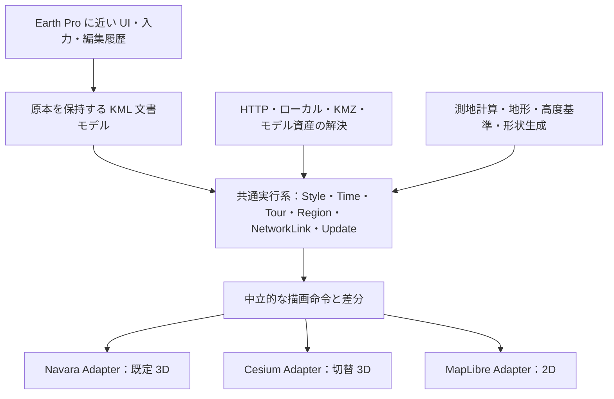

# Digital Earth Browser：技術選定と実装方針

調査日：2026-09-15

## 推奨する構成

**TypeScript + Vite の静的 Web アプリに、描画エンジンから独立した KML 2.3 実行基盤を実装する構成を推奨します。** 3D の既定を Navara、切り替え先を CesiumJS、2D を MapLibre GL JS とします。

主要な開発対象は、KML 文書を解釈し、時間・通信・カメラ・スタイル・表示を連動させる共通層です。各エンジンに付属する読み込み機能だけで全仕様を満たせるとは考えない設計にします。

この文書は設計提案です。パッケージのインストール、試作アプリの実行、性能測定、Google Earth Pro 実機比較は今回実施していません。確定させるべき技術条件を初期の実証課題として明示しています。

## 1. 調査で確認できた重要事項

### KML 2.3 は 2.2 と異なる要件を持つ

名前空間は `http://www.opengis.net/kml/2.2` を継続します。Tour、Track、MultiTrack、LatLonQuad 等は 2.3 の標準対象です。従来の `gx:` 表現も読み込む場合、標準との意味対応を個別に定義します。KML 2.2 の資料だけから対応表を作ると要件が抜けます。[OGC KML 2.3 本文](https://docs.ogc.org/is/12-007r2/12-007r2.html)

### glTF のために独自 XML タグを作る必要はない

OGC の Model はモデル形式を COLLADA に限定していません。既存の `Model/Link/href` から glTF/GLB を参照するアプリ側プロファイルを定める方針が適切です。Google Earth Pro が同じ資産を表示できるかどうかは別の互換性判定とします。[OGC ATS：ATC-133](https://docs.ogc.org/ts/14-068r2/14-068r2.html)

### Cesium の KML ローダーにも不足がある

公式の KmlDataSource は KML 2.2 の不完全な対応であると明記されています。共通 KML 文書モデルや適合性判定をこのローダーへ委ねる構成は、今回の優先要件に適しません。Cesium 自体の描画能力を利用して不足を補う構成にします。[Cesium KmlDataSource](https://cesium.com/learn/cesiumjs/ref-doc/KmlDataSource.html)

### Navara は拡張しやすいが、導入版の固定が必要

Navara の公開変更履歴では 2026-08-28 の v0.1.0 が beta とされ、その後にも入力 API の破壊的変更があります。導入時のバージョンと peer dependency を固定してください。本調査では npm の最新タグは確定していません。[Navara CHANGELOG](https://github.com/maplibre/navara/blob/main/CHANGELOG.md)

Navara の現在の描画実装は Three.js です。Cesium を Navara 内部のバックエンドとして差し替える構想にせず、アプリ自身が二つのアダプターを持ちます。[Navara アーキテクチャ](https://navara.world/docs/guides/for-contributors/architecture/)

## 2. 技術スタック

以下は採用推奨と、採用前に検証する候補です。バージョンは導入時に確定します。

| 領域 | 推奨 | 選定理由・条件 |
|---|---|---|
| 言語・ビルド | TypeScript strict、Vite、pnpm workspace | 静的配信、型を持つ共通契約、エンジン別の分割読み込み |
| UI | React、Zustand、アクセシブルな UI 部品 | Places ツリー、プロパティ、設定を構成。描画フレームは UI 更新から分離 |
| 既定 3D | `@navaramap/three`、`@navaramap/three-default-plugin` | Three.js と postprocessing の依存を照合し、KML 用 Descriptor を追加 |
| 切替 3D | `cesium` | 地球、地形、glTF、時系列の描画能力を共通層から利用 |
| 2D | `maplibre-gl` | 平面表示の専用アダプター。GeoJSON は派生データとして利用 |
| KML | 独自の文書モデル・Validator・実行系・Serializer | 要素を読むだけでなく、通信、時刻、表示、保存まで意味を維持 |
| XML | 初期候補 `@xmldom/xmldom` を Worker 内で利用。大規模経路はストリーム解析を比較 | 名前空間・未知拡張・順序保持の適合試験を優先 |
| KMZ | `fflate` 候補＋仮想ファイルシステム | 相対参照、必要資産の展開、キャンセル、保存 |
| モデル | Three.js loaders ＋独立したモデル処理層 | COLLADA と glTF/GLB、テクスチャ解決、座標軸・単位変換 |
| 計算 | Web Workers、TypedArray、空間・時間索引、測地計算 | UI 応答を保ち、必要な範囲だけ処理 |
| 永続化 | IndexedDB、任意 OPFS、File/Blob | ローカル中心の利用。ブラウザ差を吸収 |
| 試験 | Vitest、Playwright、画像差分、XSD 1.1 検証、性能シナリオ | 文書適合・動作・描画・配信を別々に検証 |
| 公開 | GitHub Actions → GitHub Pages | 必須の実行サーバーを持たない |

Navara のパッケージと初期化方法は [Getting Started](https://navara.world/docs/guides/introduction/getting-started/)、2D の導入方法と Worker 設定は [MapLibre 公式文書](https://maplibre.org/maplibre-gl-js/docs/)を基準にします。

プロジェクト本体は Apache-2.0 を第一案とします。Navara は MIT/Apache-2.0 の選択式、CesiumJS は Apache-2.0、MapLibre GL JS は BSD 系のライセンスです。採用版の依存と同梱コードを確認し、LICENSE/NOTICE とデータの出典を別々に管理します。[Navara](https://github.com/maplibre/navara#license)、[CesiumJS](https://cesium.com/platform/cesiumjs/)、[MapLibre LICENSE](https://github.com/maplibre/maplibre-gl-js/blob/main/LICENSE.txt)

### XML パーサの選定を初期実証に含める理由

XML が読めること、名前空間を正しく扱うこと、XSD 検証ができることは異なります。例えば sax-wasm はストリーム解析が可能ですが、厳密な検証は呼び出し側の責務とされています。また saxes は名前空間対応がある一方、公式リポジトリはアーカイブ済みです。速度だけで選ばず、異常 XML と KML の往復保存を含む試験で決めます。[sax-wasm](https://github.com/justinwilaby/sax-wasm)、[saxes](https://github.com/lddubeau/saxes)

## 3. 共通 KML 基盤の設計

この構成では、エンジンを切り替えても KML を読み直す必要がありません。同じ文書・時間・選択・編集状態から描画命令を作り直せます。実行系の仕様試験を一度共通化し、描画差はアダプターの試験で確認できます。

### 要点

- **原本を保持する。** GeoJSON だけに変換すると失われる階層、スタイル、参照、時刻、ツアー、未知拡張を残す。
- **表示と実行を分ける。** NetworkLink の更新や Tour の進行をエンジンごとのローダーへ重複実装しない。
- **差分で更新する。** 共有 Style の変更や Update を、対象の描画要素へ伝える。
- **座標系を明示する。** 地理座標、ECEF、局所座標、ジオイド基準、楕円体高、画面座標を区別する。
- **2D の意味を定義する。** 3D モデル・斜め視点・PhotoOverlay を平面でどう操作するかを定義し、元の3D状態を保持する。
- **一つの3Dエンジンを稼働する。** 切り替え時に GPU を解放し、文書と取得済み資産を維持する。

## 4. 「全対応」を確認する仕組み

次の四つを別に集計します。

| 判定 | 何を確認するか |
|---|---|
| KML 文書適合 | XSD 1.1、本文の制約、ATS、保存した文書の適合性 |
| KML 実行・描画 | 時間、通信、更新、LOD、Overlay、ツアー等が仕様に従って動くか |
| Earth Pro 互換 | 対象版と歴代機能の入出力、追加拡張、操作・表示・製品機能 |
| 外部サービス利用 | 画像、地形、検索、履歴、パノラマ、機器等が利用できる条件 |

対応表には各要件ごとに、解析、検証、実行、Navara 表示、Cesium 表示、2D 表現、編集、保存、試験を記録します。公式スキーマと対応表を照合し、「項目を書き忘れたために100%になった」状態を防ぎます。

OGC の文書試験に合格するだけで描画の全機能対応を証明できるわけではありません。XSD 1.1 の検証器として Python の `xmlschema.XMLSchema11` 等を評価し、通信・時間・表示・操作の試験を別途作成します。[OGC ATS](https://docs.ogc.org/ts/14-068r2/14-068r2.html)、[XMLSchema11](https://xmlschema.readthedocs.io/en/latest/features.html#xsd-1-0-and-1-1-support)

## 5. 難しい機能を先に実証する

| 課題 | 初期に確かめること |
|---|---|
| Navara の拡張 | 独自 Mesh、地形への貼り付け、picking、動的更新、公開カメラ API、破棄 |
| NetworkLink | 全更新条件、CORS、認証、循環、更新とキャンセルの競合 |
| Region / SuperOverlay | 画面投影による LOD、親子関係、画像の遅延取得、fade |
| PhotoOverlay | 非対称 ViewVolume、3形状、ImagePyramid、写真への入退場 |
| COLLADA | 原本・テクスチャ・ResourceMap・軸・単位・材質を保つ変換 |
| Tour | カメラ・音声・AnimatedUpdate、並列と直列、停止・シーク・復元 |
| 高度 | KML と各地形プロバイダーの高さの基準、海底、精度 |
| 静的配信 | サブパス、WASM/Worker、追加ヘッダーのない通常環境 |

Navara の [Custom Descriptor](https://navara.world/docs/three/core/custom-desc/) は拡張の入口になりますが、全 KML の実証が済んだという意味ではありません。動的ポリゴン・線については上流の課題も確認し、導入版で試します。[Navara Issue #548](https://github.com/maplibre/navara/issues/548)

COLLADA→glTF 変換は有力な初期経路ですが、Three.js の ColladaLoader は部分実装です。変換して表示できた一例を全 Model 対応の証拠にできません。対象ファイル群から不足を確認し、補完する必要があります。[ColladaLoader](https://threejs.org/docs/pages/ColladaLoader.html)

## 6. Google Earth Pro に近い操作

画面構成は、左の検索・場所・レイヤー、中央の地図、上のツール、右上のナビゲーション、下の座標・高度・出典を基本にします。設定から `Earth Pro 互換 / 現在のエンジン標準 / カスタム` を選べるようにします。

互換モードは共通 InputController と CameraController で実装します。ボタン割り当てに加え、地表の掴み方、注視点、回転中心、ズーム目標、慣性、自動傾斜を調整します。

| 入力の基準項目 | 対応する操作 |
|---|---|
| 左ドラッグ | 地球・地図の移動 |
| ホイール | ズーム |
| 中ボタン・Shift 等 | 傾斜・回転。OS 別割り当てを検証 |
| 右ドラッグ等 | ズームと自動傾斜。macOS の修飾キー差を検証 |
| N / U / R | 北上 / 真下 / 表示リセット |
| Space | 移動停止 |

この表を実装済みの互換表とはせず、対象版・OS・マウス・トラックパッド・自然スクロールを固定した試験の出発点にします。[Google ショートカット](https://support.google.com/earth/answer/148115?hl=en)、[Google マウス操作](https://support.google.com/earth/answer/148186?hl=en)

「すべての機能」を KML の表示だけに狭めず、作図、計測、地形断面、可視領域分析、検索、外部形式、画像・印刷・動画、GPS、飛行機能、他天体等の台帳も持ちます。現行公式リリースノートでは追加の KML 拡張にも言及されているため、対象版と過去機能の棚卸しが必要です。[Earth Pro リリースノート](https://support.google.com/earth/answer/40901?hl=en)

## 7. GitHub Pages でできる範囲

**Pages にアプリを置くことと、任意の外部データを無条件に読めることは別です。** アプリは静的配信で成立しますが、外部 URL は配信元の CORS・HTTPS・認証条件に従います。CORS を許可しない相手を、Service Worker や `no-cors` で読み取り可能にはできません。[GitHub Pages の仕組み](https://docs.github.com/en/pages/getting-started-with-github-pages/what-is-github-pages)、[MDN CORS](https://developer.mozilla.org/en-US/docs/Web/HTTP/Guides/CORS)

| 条件 | 推奨設計 |
|---|---|
| ローカル KML/KMZ | ユーザーのファイル選択・ドラッグ投入、ブラウザ内処理 |
| CORS 対応 HTTPS データ | Fetch、共通 resolver、キャッシュ |
| CORS 非対応・HTTP-only・特殊認証 | 配信側設定変更、ユーザー管理の任意プロキシまたは companion |
| Google 固有のデータや機能 | 利用可能なデータ/API の接続口と、必要条件を明示 |
| 全球の大規模資産 | 外部の対応ストレージ/サービスから必要範囲を取得 |
| 単独起動 | 小規模の同梱データとサンプルでキーなし起動 |

Pages の公開サイトは最大 1 GB、帯域には月 100 GB のソフト上限があります。全球データの主配信基盤として使わず、アプリと小規模な例を置く設計が適します。[GitHub Pages 上限](https://docs.github.com/en/pages/getting-started-with-github-pages/github-pages-limits)

PMTiles は大規模な静的タイル配信の選択肢です。HTTP Range で必要な部分を取得するため、配信先の Range と CORS を検証します。[PMTiles](https://docs.protomaps.com/pmtiles/)

通常 Worker と Transferable を基本とし、SharedArrayBuffer/WASM threads を必須化しません。共有メモリに必要な分離条件を満たせるかは配信環境に依存します。Navara の採用版で追加ヘッダーなしの動作が成立するかは、最初の実証で確認する未解決事項です。[crossOriginIsolated](https://developer.mozilla.org/en-US/docs/Web/API/Window/crossOriginIsolated)

## 8. 性能を改善する順番

1. **不要な仕事を減らす。** Region・画面範囲・時間による取得/表示制御、差分更新、変更時のみ描画。
2. **操作を止めない。** 展開、XML、形状、索引等を Worker へ移し、進捗・キャンセルを提供。
3. **メモリを制御する。** 原本/DOM/AST の重複を抑え、LRU、テクスチャ共有、GPU 解放を管理。
4. **GPU 転送を減らす。** バッチ、インスタンシング、局所座標、TypedArray。
5. **初期取得を減らす。** エンジンの動的 import、重い機能の遅延読み込み。
6. **実測して局所改善する。** Rust/WASM や圧縮形式を必要箇所へ導入。

Cesium の requestRenderMode、Navara の変更時描画設定等を使えますが、時間・ツアー・モデルアニメーションを止めない連携が必要です。[Cesium Scene](https://cesium.com/learn/cesiumjs/ref-doc/Scene.html)、[Navara ThreeView properties](https://navara.world/docs/three/api/threeview-properties/)

基準 PC・1080p で通常操作の p95 フレーム時間 33ms 以下、UI 応答 p95 100ms 以下を初期の目標案とします。まだ測定結果ではありません。データ規模、GPU、ブラウザ、DPR、通信、キャッシュ条件を固定して予算を決めます。10万点、大きな線/面、SuperOverlay、更新、複数モデル、切り替え反復を別々に測ります。

## 9. 段階開発と着手順

| 段階 | 主な成果 | 次へ進むための確認 |
|---|---|---|
| 0 | 仕様台帳・設計・Navara と Pages の実証 | API、カメラ、独自描画、配信上の重大阻害条件を把握 |
| 1 | KML/KMZ→3エンジン表示→保存の基本経路 | 文書と状態が切り替えで失われない |
| 2 | NetworkLink・Update・Region・時間・SuperOverlay | 通信/時間/LOD の意味がエンジン間で一致 |
| 3 | PhotoOverlay・Model・Tour・全2.3残項目 | 全仕様台帳と機能組合せ試験を充足 |
| 4 | Earth Pro の製品機能・歴代機能 | 操作・編集・分析・入出力・サービス接続を評価 |
| 5 | 性能・機種差・配布整備 | 対応表、性能結果、導入手順、ライセンス、公開ビルド |

PhotoOverlay、COLLADA、Tour の技術実証は段階0～2で並行します。難しい機能を最後まで調べずに残す進め方は避けます。性能計測と配信確認は各段階で継続します。

全機能の完成工数は、Navara の不足、対象 KML 群、対象端末、地形データ、歴代機能の棚卸しに依存するため、今回の資料調査だけでは妥当に確定できません。まず初期実証と機能台帳から、補完が必要な機能ごとに見積もるのが適切です。

## 10. Claude Code への渡し方

添付の `claude-code-master-prompt.md` を実装用リポジトリの `docs/` 等に置き、その全体を仕様として読ませます。初回は仕様整理と基礎実証・最初の動く実装を進め、以降は同じ台帳と状態記録を継続します。

開始指示例：

> `docs/claude-code-master-prompt.md` を全体の要求仕様として読んでください。Navara 公式の採用版、OGC KML 2.3 と XSD/ATS を確認し、Phase 0 と Phase 1 の最初の動く実装に着手してください。既定 Navara、Cesium 切替、MapLibre 2D、Earth Pro 互換操作、GitHub Pages 配信の条件を維持してください。機能台帳と試験に基づいて進め、部分実装を全機能対応として報告しないでください。

Navara 同梱スキルの位置は [skills/navara-usage/SKILL.md](https://github.com/maplibre/navara/blob/main/skills/navara-usage/SKILL.md) です。導入した版の関連ファイルも合わせて読ませると、API の取り違えを減らせます。
